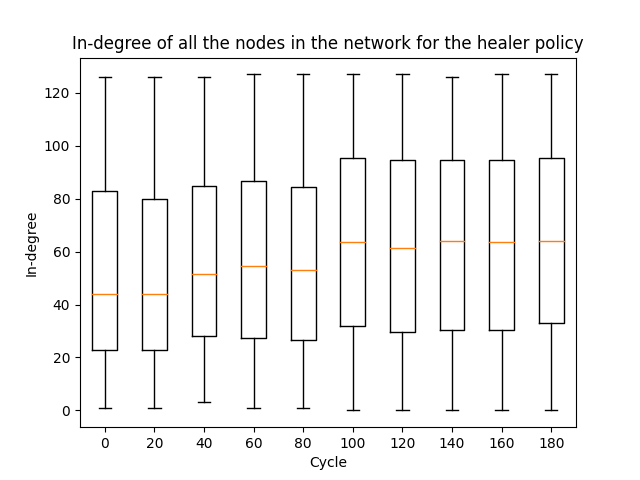
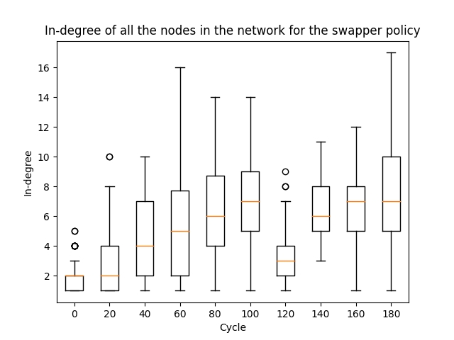

# LSINF2345 Project: The Peer Sampling Service (Group E)

We are the group E, composed of:
- BOGAERT Jérémie (5287-1500)
- DE KEERSMAEKER François (7367-1600)

This report will present our work for the project for the course LSINF2345 -
Languages and Algorithms for Distributed Applications,
which covers the peer sampling service in a network of nodes.

The contents of this report are the following:
- Deployment of a bootstrap network, with the help of a specific data structure;
- Peer sampling service implementation;
- Evaluation of the service with an experimental scenario.

All the source code is available in the [src](src/) folder,
and the graphs are available in the [graphs](graphs/) folder.


## Deployment of the bootstrap network

Before starting the peer sampling service, a first network of nodes has to be deployed.
To represent this first network, we can use 2 data structures: a binary tree, or a double linked list.
All the nodes will be added to the data structure before starting the service.
In this way, all the nodes have a non empty view when they start the service,
and can directly exchange with their peers.

To implement these data structures in practice, we use an Erlang node that will act as a server.
Every node in the structure is simply represented by an increasing ID,
assigned by the server when the node is added to the structure.
To enable interaction, the server allows the reception of two messages, sent by a node:
- join, that adds the node to the data structure, and responds to it with its ID;
- getPeers(NodeId), that gets and responds with the neighbors of the node
corresponding to the node ID sent along the message.

The implementation of the server is available in the file [bootstrap_server](src/bootstrap_server.erl).
The file [tree](src/tree.erl) contains the core implementation of the binary tree,
and the file [linked_list](src/linked_list.erl) contains the implementation of the
double linked list.
The binary tree implementation is the one that was given in the [examples](examples/) folder,
with a small modification such that the atom `nil` is not contained in the neighbors of the root.

Some unit tests are also present at the end of the file [bootstrap_server](src/bootstrap_server.erl).
They check if the nodes are correctly added to the data structure,
and if the neighbors are the ones expected.
To run these tests, simply run the command `make test` in the [src](src/) folder.


## Peer sampling service implementation

The implementation of the peer sampling service is available in the Erlang files
[node](src/node.erl) and [utils](src/utils.erl).
The first one contains the code related to the handling of messages received by
the nodes, and the logging.
The second one contains a lot of functions that are used for the peer sampling service,
including function for the peer selection, the view propagation, and the view selection.

In practice, a node has 3 states:
- `down`, when it has been created, but is not running the peer sampling service,
or has crashed;
- `up`, when it is running the peer sampling service;
- `waiting`, when it has sent a push message to a peer, and is waiting for its response
(when the pushpull strategy is selected), or simply is waiting to log its view for the current cycle.

At each cycle, every node that is in the `up` state will run an iteration of the service,
upon reception of an `active` message from the main process that monitors the whole network.
This message also contains the number of the current cycle,
so that the node knows which is the current cycle.
The duration of a cycle has been set to 3 seconds, as advised in the project statement.

Every peer in the view of a node has an integer that defines its age.
Instead of initializing the age of a node to 0 when it sends its descriptor to one of its peers,
and incrementing the age of all the peers in the view at each cycle,
we chose to use the cycle at which the descriptor was sent.
In this way, the freshest peers are not the ones that have the lowest age, but the highest cycle,
as this means that the descriptor was sent more recently.
This avoids processing the whole view of each node at the end of each cycle
to increment the age of each peer in the view.


## Evaluation with experimental scenario

The code for the experimental scenario is available in the [project](src/project.erl) file.
To launch the scenario, when all the files of the [src](src/) folder have been compiled,
one simply has to run the following command in an Erlang shell in the [src](src/) folder:
```erlang
project:launch(N, Struct, Params).
```
The arguments of this function are defined as follows:
- `N` (int): the maximum number of nodes in the network. The advised value is 128.
- `Struct` (atom): `tree` or `linked_list`, used to set the data structure that will be used to build the initial network.
- `Params` (tuple): contains the parameters of the peer sampling service.
This tuple has the following format: `{ViewSize, Selection, Propagation, H, S}`.
The parameters are defined as follows:
  - `ViewSize` (int): maximum view size. The advised value is 7.
  - `Selection` (atom): `rand` or `tail`, defines the peer selection strategy that will be used.
  - `Propagation` (atom): `push` or `pushpull`, defines the view propagation strategy that will be used.
  - `H` (int): self-healing parameter.
  - `S` (int): swapping parameter.


A Makefile is also provided, that compiles and run the experimental scenario twice,
with the required parameters, and stored the logs of the execution in text files,
that will be processed by the post-processing script to produce the graphs.
The first execution followed the healer strategy for view selection, and the second one
followed the swapper strategy.
For both executions, the parameters that had the same value are the following:
`N` = 128; `Struct` = `tree`; `ViewSize` = 7; `Selection` = `rand`; `Propagation` = `pushpull`.
The parameters that were changed are the following:
- `H` = 4 and `S` = 3 for the first execution, i.e. the healer selection;
- `H` = 0 and `S` = 4 for the first execution, i.e. the swapper selection.

To run this Makefile, simply execute the `make` command in a terminal in the [src](src/) folder. The logs of the two execution are placed in the [graphs](results/) folder,
in the files [healer.data](results/healer.data) and [healer.data](results/swapper.data), respectively.

The post-processing pyhton script is available in the [compute_indegree](src/compute_indegree.py) file.
It computes the in-degree of each node in the network, every 20 cycles, for both
experimental scenarios.
To this end, we keep, a list of dictionaries, one for each of the measured cycles.
Each dictionary contains key-value pairs, where the key is the node ID,
and the value is the in-degree of the node.
Then, to compute the in-degree, the logs of each measured cycle are processed,
and every time a node contains a certain other node in its view for this cycle,
the in-degree is incremented for this other node.

After having computed the in-degree of every node, for every relevant cycle,
the script produces one graph by policy, containing box-plots of the results.
These graphs are shown below:




On both graphs, we see that the in-degree starts quite low.
This is due to the fact that, initially,
only a subset of the nodes are active,
and the view of the nodes only contain their initial neighbors in the bootstrapping data structure.
Then, the in-degree increases, as the nodes exchange their views with others,
and thus increase the size of their views and the number of nodes they point to,
which involves that, in general, the nodes have more other nodes that point to them,
which increases their in-degree.
Besides that, more nodes join the network, which adds to the number of links toward
the nodes as well.

At cycle 120, we observe that the in-degree drops drastically.
This is due to the experimental scenario, that crashes a big amount of nodes at this cycle.
As a result, the links coming out of these crashed nodes are not counted anymore,
which reduces the general in-degree.

At cycle 150, most of the crahsed nodes will be restarted,
each having the same active node in their view.
Thanks to that, one active node will have a high in-degree at this cycle.
We can still see this on the 160th cycle of the healer policy graph,
where there is an outlier with a very high in-degree.
However, this cannot be seen in the swapper policy graph,
as the swapping will remove this node from the view of the restarted nodes.
